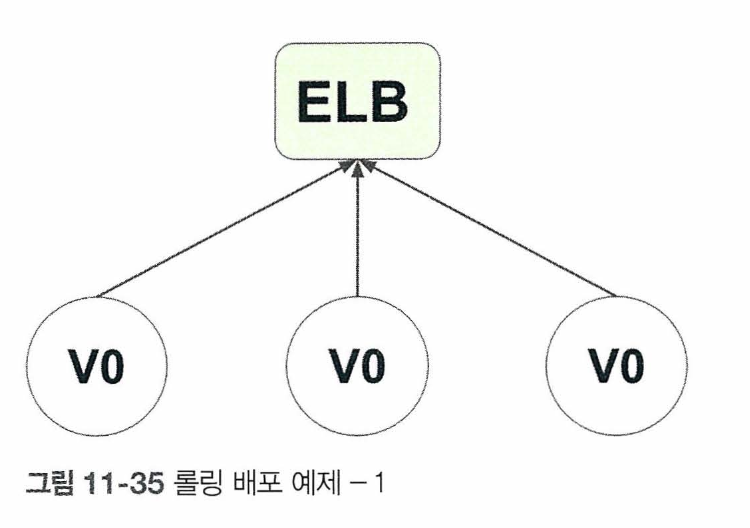

# 코드 통합, 테스트, 배포를 한 번에! CI/CD란?

먼저 CI/CD를 분리해서 봐보자!

## CI

CI, 지속적 통합(Continuous Integration)은 소프트웨어 개발에서 코드 변경 사항을 자주 통합하고 자동으로 빌드 및 테스트하는 프로세스를 의미한다.

더 풀어서 보자면 프로젝트를 수행할 때 다른 개발자의 코드도 있을 것이고 내가 개발한 코드도 있을 것이다. 이 코드를 중앙에 올려 원하는 결과물을 잘 만들었는지 , 잘 돌아가는 지 검증해야 한다.

하지만 사람은 실수하기 마련이고, 만약 에러가 발생한다면 CI를 통해 손쉽게 해결하여 불필요하게 발생하는 에러를 줄일 수 있다.

> 💡 개발자는 CI를 통해 코드 충돌을 피하고 본인 코드에 집중할 수 있다.

## CD

CD, 지속적 배포(Continuous Delivery)는 코드 변경 사항이 자동으로 빌드되고 테스트된 후, 프로덕션 환경으로 배포할 수 있는 상태로 유지되는 프로세스를 말한다.

이것도 풀어 이해해보자면 개발자는 하루에 수십 개의 버그를 고치고 프로덕션에 배포하여 서버의 다운 및 소프트웨어 셧다운 현상을 피해 사용자가 불편함을 느끼지 못하도록 해야한다.

그리고 그러한 과정(버전 공개, 어떤 버그 고쳤는지)을 플레이어에게 알려야 한다. 아무튼 배포과정은 복잡하며 잦은 실수가 나올 수 있으나 CD 덕분에 그 부담을 덜 수 있다.

## CI CD 공존

CI와 CD는 함께 공존한다.

위의 그림처럼 소프트웨어 개발은 무한 루프처럼 끝없는 반복과정을 거치면서 이루어진다. 개발자가 모든 과정을 관리하는 것은 어려우며, 잦은 실수를 범할 수 있다. <b>CI/CD는 자동화 개념을 도입하여 소프트웨어 개발 과정을 편하게 해준다.</b>

# CI/CD 장점?

## 소프트웨어 개발 시 반복적 잡업을 모두 자동화

- 소프트웨어 개발 시 반복적 잡업을 모두 자동화해주기 때문에 소프트웨어 개발이 빨라지고, 운영되고 있는 프로덕션에서 패치 또는 새로운 기능을 배포할 수 있다.
- 또한 중앙 레포지토리에 새로운 코드를 반영 시키기 전 테스트를 돌려 프로덕션에 배포하는 데 문제가 없는지 점검해야 하는데, 이를 CI/CD가 자동으로 해준다.

## 점진적 변화

[ 쇼핑몰 웹사이트 ]

- 유저가 아이템 가격을 보려고 했는데, 가격 정보가 없는 상황 -> 그래서 가격을 알 수 없다는 문의 사항 접수. 개발자는 이 버그를 수정해야 함. 모든 수정사항을 한 번에 수정할 수는 없다.
- 그럼 가격을 보이게 하기 위해 X,Y,Z 기능을 개발해야 한다고 가정하면, 우선 X를 개발하고 X에 대한 테스트를 거친 후 Y로 넘어간다. 그 후 Y에 대한 테스트를 거친 후 Z 구현
- 이러한 일련의 과정들을 <b>점진적 변화</b>라고 한다.
- CI/CD가 점진적 변화를 가능하게 해준다는 것은 엄청난 것! 만약 없다면?
  - 개발자가 작성한 코드에 에러 발생! 이전 버전으로 롤백하고 싶을 때는?
    - 개발자가 매번 백업을 해야함. 그럼 이 백업은 어디에 보관? 테스트는 또 어떻게? 충돌이 일어나면 이 문제는 어떻게? (ptsd😅)
- 즉 CI/CD가 없다면 위와 같은 다양한 어려움이 발생한다!

# 리포지토리 개념 이해하기!

리포지토리는 코드를 보관하며, 회사나 단체에서 수믾은 개발자 코드를 공유하고 수정하는 곳이다. 리포지토리는 금방 이해할 수 있다. 가장 유명한 리포지토리가 깃허브이다.

깃허브를 사용해 코드를 업로드 하고, 다른 개발자 코드에 영향이 가지 않게 하면서 코드를 관리하고 통합하는 것이 가능

하지만 단순 코드를 업로드하고 보관하는 기능 용도로만 사용되지 않는다. 웹사이트를 호스팅 할 수도 있고, AWS의 힘을 빌려 CI/CD 기능을 깃허브와 함께 사용하여 테스트를 자동화할 수 있다.

깃허브에 파일 중 어떤 파일의 변화가 감지됐을 때 그에 대한 테스트를 자동으로 돌려 문제가 없는지 검증한다. (자연스레 경험했겠지만, 우리가 PR올리면 중앙코드와 충돌은 없는지 깃헙이 확인 해줬던 경험💭)

# 깃허브 브랜치 개념 이해하기

브랜치는 크게 로컬 브랜치와 마스터(메인)브랜치로 분류된다. 로컬 브랜치는 개발자가 프로그램을 개발하고 테스트 하는 곳이며, 마스터 브랜치는 실제 프로덕션에서 사용되는 코드를 담고 있는 곳이다. 로컬에서 개발/테스트 하고 마스터 브랜치로 코드 합치기

리포지토리도 로컬 리포지토리와 원격 리포지토리로 나뉜다. 로컬 리포지토는 개발자는 브랜치를 만들고 코드 구현하는 곳. 원격 리포지토리는 깃허브 웹사이트에서 생성한 리포지토리이며 마스터 브랜치가 하나 존재한다. 이를 클론해서 리포지토리에 있는 내용을 그대로 로컬에 가져온다.

로컬 브랜치에서 개발 및 테스트 과정을 마치면 원격 리포지토리로 푸쉬해야한다. 여기서 로컬 브랜치는 아직 마스터 브랜치와 합쳐지지 않고 다른 개발자의 승인 및 검증 과정을 성공적으로 거친 후 마스터 브랜치와 합쳐지며 마스터 브랜치 내용물에 변화!

원격리포지토리와 로컬리포지토리의 마스터 브랜치는 싱크가 되어 있지 않으니, 로컬 브랜치를 만들기 전에 로컬 마스터 브랜치를 업데이트 해줘야 한다.(풀 받으세요!!)

> 🪐 궁금증 브랜치가 합쳐지는 원리? 💭  
> <<Git의 데이터 구조와 원리를 짧게 알아보자>>  
> Git은 전통적인 버전 관리 시스템과 다르게 모든 데이터를 스냅샷으로 저장하며, 이 스냅샷은 파일 시스템의 상태를 기록하는 방식으로 이루어진다.

1. 오브젝트 데이터베이스
   Git은 블롭(Blob), 트리(Tree), 커밋(Commit) 오브젝트로 데이터를 관리한다.

   - 블롭(Blob): 파일의 내용 자체를 저장하며, 파일의 이름이나 위치는 저장하지 않는다.
   - 트리(Tree): 디렉토리 구조를 나타내고, 블롭과 다른 트리 오브젝트를 가리킨다.
   - 커밋(Commit): 프로젝트의 특정 시점 상태를 나타내며, 트리와 부모 커밋을 참조한다. 커밋 메시지와 작성자 등의 메타데이터도 포함된다.
   - 커밋은 트리 오브젝트를 가리키며, 이 트리 오브젝트는 디렉토리와 파일의 구조를 나타낸다. 트리 오브젝트는 다시 블롭(Blob) 오브젝트를 가리키며, 블롭은 실제 파일의 콘텐츠를 저장한다.

2. 브랜치
   Git에서 브랜치는 특정 커밋을 가리키는 <b>가벼운 포인터</b>이다. 예를 들어, main 브랜치는 최신 커밋을 가리키고, 새로운 커밋이 추가되면 포인터가 자동으로 최신 커밋으로 이동한다.

3. 병합(Merge) 과정
   두 브랜치를 병합할 때, Git은 두 브랜치의 <b>공통 조상(commit)</b>을 먼저 찾는다. 공통 조상은 병합하려는 두 브랜치가 동일한 커밋에서 갈라져 나온 시점을 의미한다.

   - Git은 공통 조상, 첫 번째 브랜치의 마지막 커밋, 두 번째 브랜치의 마지막 커밋을 비교해서 3-Way Merge(두 브랜치에서 각각 변경이 발생한 경우하는 병합)를 수행한다.
   - 3-Way Merge: 공통 조상과 두 브랜치의 변경 사항을 비교해서 새로운 커밋을 생성한다. 이 커밋은 두 부모 커밋을 가리키며, 병합 과정에서 변경된 모든 내용을 포함한다.

4. Git의 내부 알고리즘
   Git은 병합할 때 diff3 알고리즘을 사용한다. 이 알고리즘은 각 파일의 라인 단위로 변경 사항을 비교해서 자동으로 병합하거나, 충돌이 발생하면 수동으로 해결해야 한다.
   > 💡 diff3 알고리즘 위키피디아 : https://ko.wikipedia.org/wiki/Diff

# 배포 과정 이해하기

중앙리포지토리에 합친다고 해서 바로 프로덕션에 반영될까? 그렇지 않다. 우선 배포 준비를 해야한다. 베포 준비는 프로덕션에 적용시키기 위해 패키지를 만들거나 코드를 병합하는 과정 의미

CI/CD 덕분에 배포 준비는 자동으로 진행. CI/CD는 현재 프로덕션에서 돌아가는 코드와 최근 변경된 코드에 차이가 갑지 된다면 자동으로 배포 준비. 배포 후 예상치 못한 버그가 발견됐을 때 재빨리 버그를 수정하거나 기존 버전으로 롤백하는 작업은 개발자의 몫

배포 준비를 마쳤다면 바로 배포하여 중앙 리포지토리에 있는 최신 코드를 프로덕션에 적용 시켜야 한다.

[배포과정 이해]

각자 자기 코드 개발 중! A는 고객의 불편함을 없애기 위한 부분 코드 작성 중

메인 리포지토리에서 파란색 부분은 개발자 A에 의해 코드 수정이 반영된 영역이다. 상당히 많은 비중을 차지하지만，개발자 A의 코드 구현은 다른 개발자의 코드 구현이나 테스트에 전혀 영향을 미치지 않는다.

# 코드 커밋

코드 커밋은 파일(코드, 이미지, 동영상, 문서,애플리케이션을 돌리기 위한 다양한 라이브러리 등)을 보관하는 저장소로 사용된다. 많은 개발자가 동시에 코드 커밋에 접근하여 하나 혹은 여러 개의 파일을 업데이트하고 업로드 한다.

코드 커밋은 언제, 누가, 무슨 파일을 수정했는지에 대한 정보를 알 수 있는 버전 컨트롤 기능을 제공한다. 만약 최근 업데이트로 프로그램에 오류가 생기면 버전 컨트롤 기능을 사용해 마스터 브랜치를 이전 버전으로 롤백할 수 있다.

> 💡 커밋은 파일 시스템의 특정 상태를 스냅샷으로 저장한다. Git은 변경된 파일만 저장하는 것이 아니라, 변경 사항에 대한 포인터를 포함한 전체 프로젝트의 상태를 기록한다. 그러나 효율성을 위해 실제로는 변경되지 않은 파일의 중복 저장을 피하고, 변경된 파일에 대한 참조만 저장한다.

> 👑 Git에서 커밋은 고유한 SHA-1 해시 값을 가진 오브젝트로 저장된다. 이 해시는 커밋의 내용을 고유하게 식별할 수 있는 값이다. 커밋 오브젝트는 부모 커밋의 해시, 트리 오브젝트의 해시(디렉토리 구조와 파일들), 커밋 메시지, 작성자 정보 등을 포함한다.

### 코드 커밋 실습

AWS 코드 커밋을 통해 마치 깃허브 처럼 레포지토리를 생성하고, 브랜치 만들고 커밋하고 등등의 과정을 진행할 수 있다.

- AWS CodeCommit은 HTTPS, SSH를 활용하여, 파일을 송수신할 수 있으며, 소스 저장에 사용되는 레포지토리는 Key Management Service(KMS) 를 통해 저장 중 자동으로 데이터를 암호화
- 콘솔로 직접 리포지토리 파일 업로드 가능
- HTTPS(GRC)는 이미 깃허브를 사용하고 있다면 사용자 개인정보를 가져와서 코드 커밋과 연동할 수 있음.
- 매달 프리티어를 통해 최대 5개의 계정까지 무료로 사용할 수 있다. 이후 추가되는 계정에 대해선 1명당 1달러의 비용을 지불하면 무제한으로 저장 가능한 레포지토리를 통해 소스코드 관리 서비스를 사용할 수 있다.

### AWS 코드 커밋 사용 좋은 점?

AWS CodeCommit의 장점은 주로 AWS 생태계와의 통합 및 보안 측면에서 두드러진다.

# 코드 배포

코드 배포는 CI/CD파이프라인에서 가장 큰 비중을 차지 한다. 커드 커밋을 통해 코드가 마스터 브랜치로 병합된 후 실제 프로덕션으로 배포하기 위해 코드 배포를 거쳐야 하기 때문

코드 배포는 한 마디로 '자동 배포'이다. 리포지토리에 새로운 코드 수정 및 업데이트 발생 시 코드 배포는 이를 감지한 후 프로덕션으로 배포할 준비를 한다.

## 자동 배포의 이점?

### 1. 새로운 기능을 빨리 프로덕션으로 배포

- 배포하는 중에 서버나 소프트웨어 다운타임(스템, 서버, 네트워크, 애플리케이션 등이 정상적으로 작동하지 않거나 사용할 수 없는 기간을 의미)이 발생하지 않는다.
- 따라서 사용자는 불편함 없이 소프트웨어를 빠른 시간 내 사용할 수 있다.
- 만약 코드 배포가 없다면 개발자가 서버를 일시적으로 종료시킨 후 사용자에게 '현재 버그 수정 관련 패치 작업 및 배포로 인해 서버가 셧다운 될거다. 이용에 불편함을 드려 대단히 죄송하다'와 같은 문구를 메인에 띄운 후 배포가 종료되면 다시 서버를 재가동 할 것.

### 2. 프로덕션 배포를 하는데 개발자 개입 없음

배포가 진행되기 위해 필요한 작업을 실행하며 사람의 간섭으로 발생할 수 있는 오류를 피할 수 있다.

## 코드 배포 방법

코드 배포에는 크게 두가지 방법이 존재 한다.

### 1. 롤링 배포

롤링 배포는 점층적 배포라고 이해하면 된다.

[에를 들어 이해해보자] 
현재 상황 : 현재 프로덕션에 돌아가고 있는 인스턴스 다섯 개, 고객 요청에 의해 코드 업데이트를 했고 이를 프로덕션에 배포하려고 한다.

이 업데이트의 비중을 20%라고 가정. 그럼 첫 배포 시 현재 프로덕션에 있는 기능을 80%, 나머지 20%는 새로운 서버로 대체. 다시 말해 네 개의 인스턴스는 기존 인스턴스를 사용하며, 한 개의 인스턴스는 새로운 인스턴스로 교체 되는 것!

두 번째 배포 시 세 개의 인스턴스가 기존 인스턴스를 사용하며 이미 새로운 인스턴스로 교체된 것 이외에 추가적으로 한 개의 인스턴스토 교체된다. 결국 모든 인스턴스가 배포 과정으 거친다.

[위의 예시 과정 : 롤링배포 방식 과정]

세 개의 EC2 인스턴스가돌아가고 있으며 하나의 ELB로 묶여있습니다. ELB는 서버 트래픽을 각각의 인스턴스별로 균등하게 배분하여 서버의 부하를 줄이기 위해 사용됩 니다. 현재모든인스턴스의 버전은 VO

개발자가새로운기능구현을마쳤고롤링 배포 방식을 사용한다면 가장 먼저 발생하는 일은 첫 번째 인스턴스가 섯다운. 하나의 인스턴스가 섯다운되기 때문에 서버의 성능은 다소 멀어진다. 뿐만 아니라 첫 번째 인스턴스가 비활성화되었기 때문에 ELB에서 첫 번째 서버로의 트래픽 배분 관련 설정을 변경 해야한다.

배포가 끝났다면 첫 번째 인스턴스는 다시 활성화되며 인스턴스 버전은 VO에서 V1로 업데이트. 이 이후의 방식도 똑같이 진행 됨!

### ❓ 만약 최근에 배포한 기능에서 버그가 발견되어 이전 버전으로 돌아가야 한다면 어떻게 해야 할까?

안타깝게도 롤링 배포 방식을 사용한다면 버전을 롤백하는 것은 매우 힘들다. 인스턴스마다 V1을 VO으로 낮춰야 하며 인스턴스 개수만 큼 롤백 과정을 거쳐야 한다. 즉 한 번에 이전 버전으로 돌아갈 수 없다.

### 2. 블루그린 배포

블루는 현재 돌아가고 있는 프로덕션을 뜻하며， 그린은 새로 배포할 인스턴스를 의미한다.

이번에도 예를 들어 이해해보자. 유저는 프로덕션 서버에서 서비스 사용 중이다. 개발자는 프로덕션과 비슷한 개발 환경에서 새로운 것을 구현.

구현을 마쳤고 프로덕션에 배포하려고 할 때 블루 서버 트래픽 양이 100%였던 것을 80%로 줄이고, 나머지 20%는 그린으로 옮겨 새로운 기능을 유저에게 제공.

블루그린 방식의 궁극적 목표는 블루를 완전 셧다운 시키고 그린을 100% 활성화 하는 것이다.

---

롤링 배포와 똑같은 예제를 사용하여 블루그린 배포를 이해해보자.

다만 현재 프로덕션 에서 돌아가고 있는 서버가 파란색 네모 안에 들어있는지 확인해준다. 코드 배포는 개발자가 코드 구현을 마친 후 새로운 애플리케이션이 돌아갈 인스턴스를 생성한다. 이 인스턴스는 초록색 네모 안에 들어간다.

Vl이 ELB에 등록되었다면 서버 트래픽을 파란색에서 초랙으로 천천히 옮긴다. 결국 파 란색 영역의 VO인스턴스는 모두 비활성화되며 섯다운된다. 그렇게 초록색 부분만 남게 된다.

### ❓ 다시 돌아가서 질문, 이전 버전으로 롤백해야 한다면 블루그린 배포를 통해 쉽게 해낼 수 있을까?

답은 YES, ELB 설정만 수정하면 된다. 셧다운된 인스턴스를 다시 활성화 시키고 서버 트래픽을 다시 보내면 된다. 그러면 초록색 영역의 인스턴스는 비활성화되며 이전 버전으로 롤백은 끝난다.

이 답에서 알 수 있듯이 블루 그린 배포 방식의 가장 큰 장점은 이전 버전과 최신 버전으로의 전환이 매우 용이하다는 것.

### 그럼 블루그랜 배포가 더 좋을까?

지금까지의 예를 보면 블루그린 배포를 사용해야 한다는 생각이 들것이다. 하지만 롤링배포를 써야할 때가 있다. 바로 맨처음 배포할 때 이다.

이전 버전과 비교할 것도 없고 블루그린 배포와 비교했을 떄 빠른 배포가 가능하기 때문이다.

### 그럼 처음에도 블루그린 배포 사용하면 안되나요?

블루 그린 배포는 배포 준비를 위해 새로운 프로덕션 환경(그린)을 만들기 때문에 추가 비용이 발생한다. 시간이 지나면서 인스턴스 개수가 늘어나고 인프라가 복잡해지면 그때 블루그린 배포를 사용하는 것을 권장! 롤링 배포는 초기 개발에 사용 권장!

# 코드 파이프라인

개발자는 코드 커밋에서 리포지토리를 생성하고 코드를 수정하며 소프트웨어 개발을 하고 버그를 해결한다. 따라서 리포지토리에 있는 콘텐츠는 계속 변한다.

변경 된 코드를 적용 시키기 위해서는 빌드 테스트 배포 과정을 거쳐야 하는데, 지금까는 개발자가 수동으로 관리했었다.

그러나 코드 파이프라인은 모든 과정을 자동화한다. 개발자가 해야할 일은 이벤트와 맞는 트리거를 적용하는 것!

에를 들어 코드 커밋에서 특정 코드가 변경 되었다면 코드 파이프라인은 이를 자동으로 감지하고 빌드를 진행하라는 트리거를 만들어 적용시킬 수 있다.

코드 파리프라인은 프로그램 빌드 출시 전 테스트 배포 과정에 개입하여 개발자의 부담을 많이 덜어준다.

또한, 소프트웨어 및 애플리케이션 출시도 자동화할 수 있다.

> 💡 배포와 출시는 다르다. 출시 이전 과정이 배포!

## 코드 파이프라인 작동 방법

코드 파이프라인을 사용하기 앞서, 워크플로(workflow)를 정의해야 한다. 워크플로는 코드 커밋 리포지토리에서 특정 파일의 콘텐츠 변경이 생겼을 때 실행된다.

기존 커밋과 비교하여 새로운 변경이 감지되면, 코드 빌드(CodeBuild)를 통해 소스 코드가 컴파일 되고 테스트를 거친 후 패키지가 생성된다.

> 💡 코드 빌드는 리포지토리에서 코드 변경 시 컴파일 및 빌드를 관리하는 툴

메번 컴파일이 이루어질 때마다 어떤 파일의 코드가 언제 변경되었느지에 대한 히스토리가 저장되고 개발자는 이를 코드 빌드에서 확인할 수 있다.

패키지가 생성되었다면 개발 및 프로덕션 환경으로 코드 배포를 한다. 코드 파이프라인은 위의 모든 과정을 자동화 시키는 것이다.
