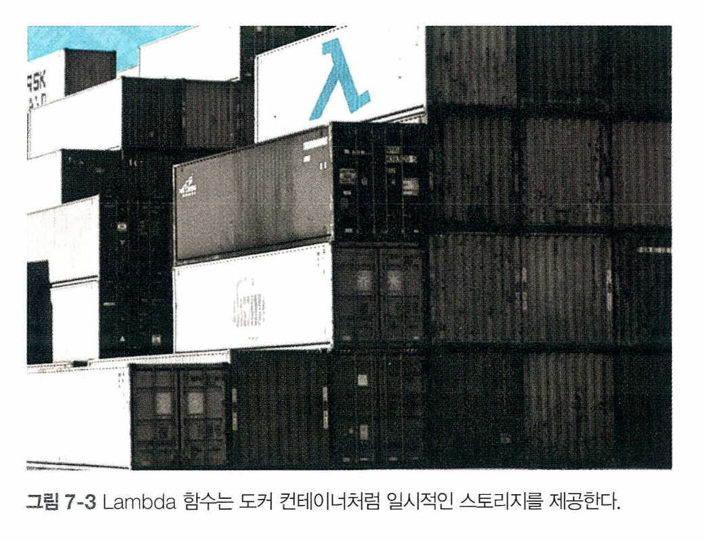
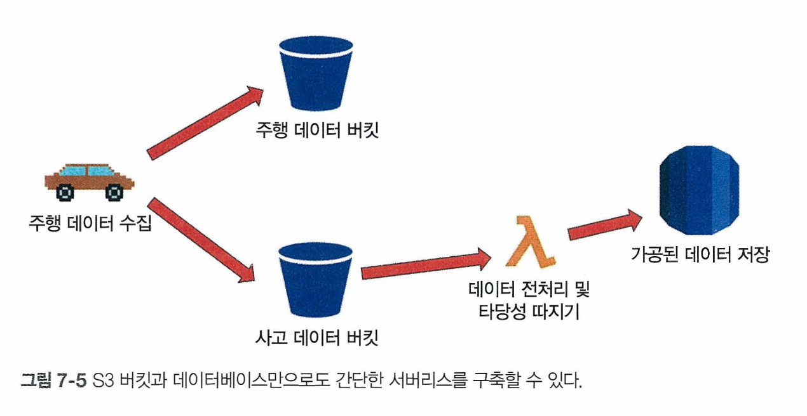
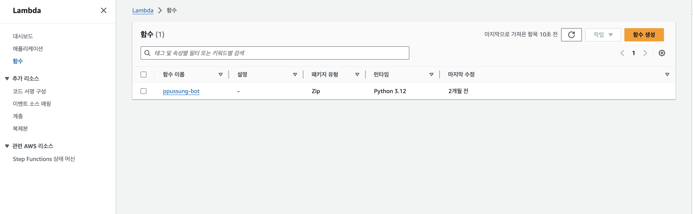
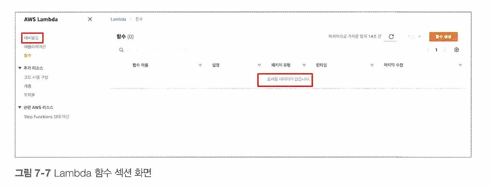
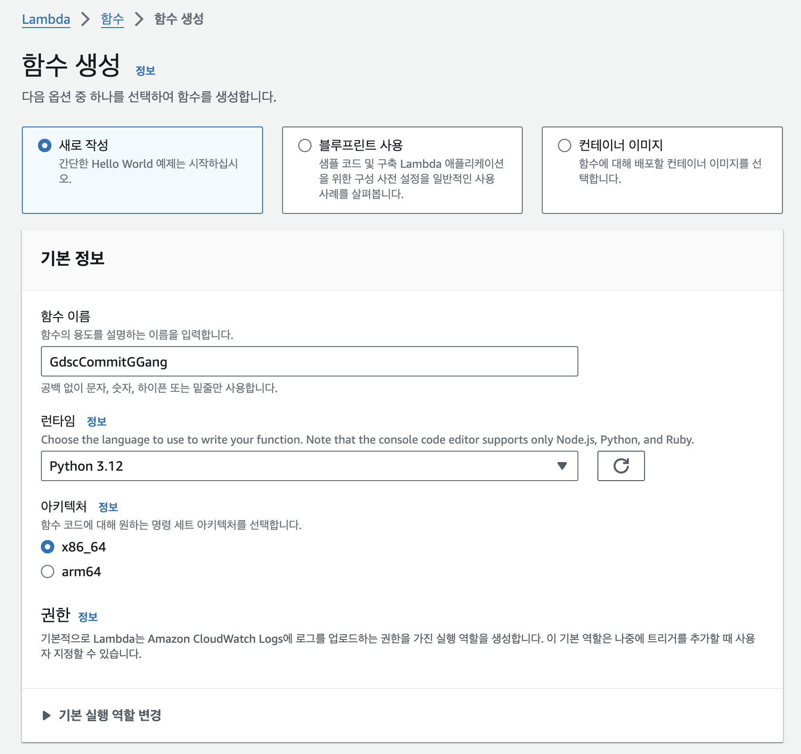
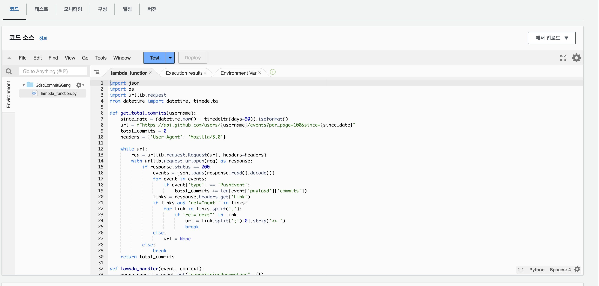
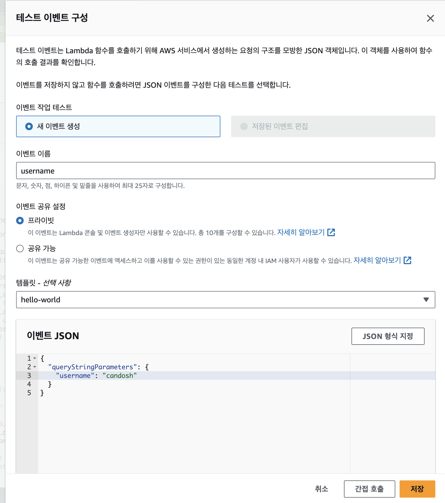
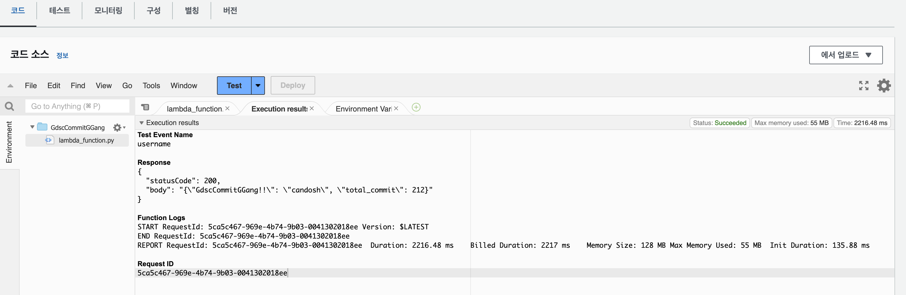

# Lambda란?

서버리스를 의논하면 절대 빠지지 않는 AWS리소스 Lambda

### Lambda의 정의

서버리스를 이해했다면 Lambda는 쉽게 이해 가능! Lambda는 서버리스의 특징과 장점을 모두 가지고 있다.

람다는 이벤트를 통해 실행된다. 여기서 이벤트란 '주어 + 동사' 형태에서 동사라고 생각하면 쉽다. 밑줄 친 부분들이 바로 이벤트!

- S3 버킷에 파일을 <u>업로드 한다.</u>
- 데이터베이스에서 특정 레코드를 <u>삭제한다.</u>
- S3 버킷에 파일을 <u>업로드 한다.</u>
- S3 버킷에 파일을 <u>업로드 한다.</u>

개발자가 Lambda에서 코드를 작성한 후 배포하면 이벤트가 발생할 경우 Lambda함수가 실행된다.


- Lambda 함수가 호출되면 코드로 원하는 로직을 실행시킬 수 있을 뿐만 아니라 또다른 AWS 리소스를 불러올 수 있다.
- Java, Go, PowerShell, Node.js, C#, Python 및 Ruby 코드를 지원하며, 그 밖에 프로그래밍 언어를 사용해 함수를 작성할 수 있도록 Runtime API도 제공한다. ( Runtime API : Lambda 함수의 실행 환경과 상호작용하기 위한 API)

### Lambda 비용 측정

먼저 Lambda는 함수를 생성하고 배포했으나 실행되지 않는다면 어떠한 비용도 들지 않는다. 이벤트가 발생하고 Lambda함수가 호출될 때만 비용이 발생한다.

AWS애서는 매달 1,000,000개의 Lambda함수 호출까지 무료이며, 이 이상부터 비용을 지불한다. 1000000번의 Lambda 호출 시 드는 비용은 약 0.20달러이다. 이는 스타트업이나 개인프로젝트에서 사용할 결우 거의 무료나 다름없다.

앞에서 Lambda함수가 다른 AWS리소스를 호출한다고 설명했었다. 만약 Lambda함수로인 다른 리소스가 사용된다면 이렇게 발생한 비용은 따로 지불해야 한다.

예시)
Lambda함수 호출 예로 Amazon SNS메시지를 사용한다고 가정해본다면, Lambda함수 호출 비용은 없으나 Amazon SNS메시지를 전송할 때 유료 기능을 사용하고 있다면 비용이 발생하게 된다.

보통 AWS Lambda와 API Gateway는 함께 사용되는 경우가 많은데, 당연한 소리지만 각각의 서비스에 대해 별도로 요금이 청구된다. 이러한 점들을 유의하면서 사용해야 한다.

### Lambda의 특징

**람다함수의 런타임**

로컬에서 코딩 했을 때 런타임이 얼마나 오래 걸리든 컴퓨터는 일을 마칠 때까지 돌아간다. 하지만 Lambda함수는 오래 기다려주지 않는다.

최대 300초(5분)의 런타임만 허용한다. 시간이 지나면서 더 방대한 양의 데이터를 처리할 때 타임아웃 에러가 발생할 수 있는데 이는 Lambda함수가 5분 이상 돌아가게 되는 경우이다. 이 점도 사용 시 유의하자.

**람다함수 공간 제공**

Lambda함수는 최대 512MB의 가상 디스크 공간을 제공한다. Lambda함수가 구동할 때 가상 컨테이너를 통해 가상 공간이 만들어지며 여기서 Lambda함수를 실행하면서 일시적으로 파일을 보관할 수 있다.


Lambda 함수 실행이 종료되면 모두 사라지지만, 임시 저장소에 보관된 파일을 다른 AWS 리소스에 서서 콘텐츠를 안전하게 옮기면 된다. 주로 데이터 전처리 시 거치는 중간 단계 과정을 디스크이 임의로 보관하고 다시 꺼내서 사용하는 데 활용된다.

**/tmp/**

- 람다 함수는 /tmp/와 같은 파일 경로를 활용하여 파일을 읽고 쓸 수 있다.
- tmp폴더에 쓰인 정보는 Lambda 함수 실행이 종료되면 모두 삭제되다.
- 똑같은 Lambda 함수를 돌려도 새로운 컨테이너가 생성되어 돌아가기 때문에 기존에 만들어진 정보는 존재하지 않는다.

**허용 배포 패키지**

Lambda 함수는 최대 50MB배포 페키지를 허용한다. 직접 AWS 콘솔에서 원하는 언어를 선택한 후 Lambda 함수를 만들 수 있으며 로컬에서 다수의 파일을 하나의 압축 파일로 만든 후 배포 과정을 통해 Lambda 함수를 만들 수도 있다.

만약 패키지 크기가 50MB를 초과할 시 배포는 이루어지지 않는다. 이럴 때는 S3버킷에 업로드한 후 AWS 콘솔에서 직접 명시해줘야 한다.

### Lambda 사용 사례

Lambda 함수가 실제로 어떻게 사용되는지 몇 가지 사용 사례를 알아보자!

### 사례 1


- S3 버킷에 파일 업로드, 파일 업로드는 사람이 직접 업로드를 하거나 파이프라인을 거쳐 업로드 되는 두 가지 방법이 있다.
- 이때 'PutObject'라는 이벤트가 발생되며 즉시 람다 함수를 실행한다.
- 람다함수는 어떤 파일이, 어디에 업로드되었는지 살펴보고 필요하다면 전처리기를 실행한다. (전처리기(Preprocessor)는 소스 코드가 컴파일되기 전에 수행되는 프로세스를 관리하는 프로그램) 전처리기를 사용하면 불필요한 데이터를 삭제하거나 수정할 수 있다.
- 람다 함수는 가공된 데이터를 데이터베이스에 업로드한다.

-> 이런 일련의 과정을 가능하게 해주는 것이 람다 함수


더 구체적인 파이프라인 구축 사례로 봐보자

위의 데이터는 크게 '주행 데이터'와 '사고 데이터'로 분류할 수 있다.

- 주행 데이터 : 운전할 때 생성되는 데이터
- 사고 데이터 : 급정거나 충돌 사고가 발생했을 때 생성되는 데이터

위의 2가지 데이터는 모두 S3버킷에 업로드, 데이터 유형에 따라 다른 버킷으로 업로드 된다.

❗️평소에 비어있던 버킷에 갑자기 사고데이터가 업로드 됐다. 이때 이벤트가 감지외더 함다 함수가 실행된다.❗️

사고 데이터가 정말 사고가 발생해서 생긴데이터인지 아니면 기계의 오작동으로 불량 데이터가 생성된 것인지 판독하는 로직을 거친다.

이 후 정말 사고가 일어난 거라면 사고 데이터를 정리해서 데이터 베이스에 업로드 하고, 다른 AWS 리소스를 호출하여 주행 대시보드를 업데이트하고, Amazon SNS를 거쳐 사고 조치를 취한다.

### 사례 2

사물 인터넷은 '토픽'이라 불리는 개념이 다양한 이벤트를 처리한다. 아두이노 사례를 통해 람다 함수 사례를 알아보자


간단히 보면 매초 온도 데이터가 들어오면 온도의 범위에 근거하여 다른 토픽으로 데이터가 전송되는 과정.

람다함수는 온도 데이터를 전달받으며 전처리를 실행한다. 만약 온도가 너무 춥거나 덥다면 데이터 전처리뿐만 아니라 Amazon SNS기능까지 사용해 경고 메시지를 보낼 수 있다.

데이터 전처리에서 단순 분량 데이터만 걸러내는 건 아니고 온도 단위를 섭씨에서 화씨로 변환하는 전처리 과정까지 람다 함수에 포함되어 있다.

> 💡 위의 두 사례에서 람다함수가 어떻게 사용? 공통점?

람다함수는 바로 중간에서 다리 역할을 담당하고 있다는 것!

이벤트에 의해서 실행되기 때문에 자기 스스로 돌아가는 것이 아니라 반드시 전제 조건이 성립해야한다.

첫 번째의 경우에는 데이터가 특정 버킷에 업로드된 경우, 두 번째는 사물데이터에서 온도데이터가 업로드될 때가 해당된다.

### Lambda 실습

람다 함수를 통해 GDSC 커밋짱을 알아보자!

[콘솔 페이지]



- AWS -> Lambda

[함수 생성]


- 함수 이름은 자유
- 런타임 실습에서는 파이썬 선택

[코드 작성]

```
import json
import os
import urllib.request
from datetime import datetime, timedelta

def get_total_commits(username):
    since_date = (datetime.now() - timedelta(days=90)).isoformat()
    url = f"https://api.github.com/users/{username}/events?per_page=100&since={since_date}"
    total_commits = 0
    headers = {'User-Agent': 'Mozilla/5.0'}

    while url:
        req = urllib.request.Request(url, headers=headers)
        with urllib.request.urlopen(req) as response:
            if response.status == 200:
                events = json.loads(response.read().decode())
                for event in events:
                    if event['type'] == 'PushEvent':
                        total_commits += len(event['payload']['commits'])
                links = response.headers.get('Link')
                if links and 'rel="next"' in links:
                    for link in links.split(','):
                        if 'rel="next"' in link:
                            url = link.split(';')[0].strip('<> ')
                            break
                else:
                    url = None
            else:
                break
    return total_commits

def lambda_handler(event, context):
    query_params = event.get("queryStringParameters", {})
    username = query_params.get("username")

    if not username:
        return {
            'statusCode': 400,
            'body': json.dumps({'error': 'Username is required'})
        }

    total_commits = get_total_commits(username)


    return {
        'statusCode': 200,
        'body': json.dumps({'GdscCommitGGang!!': username, 'total_commit': total_commits})
    }
```



- 작성 후 Depoly 클릭!

[테스트 코드 작성]


```
{
  "queryStringParameters": {
    "username": "candosh"
  }
}
```

[테스트 출력]

