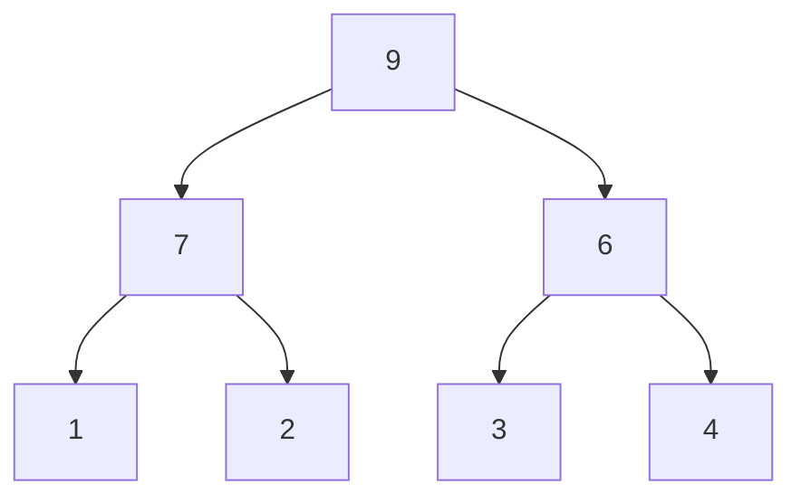
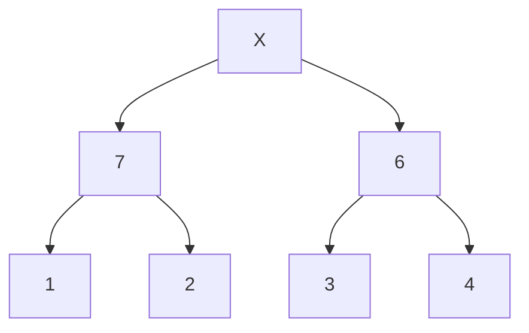
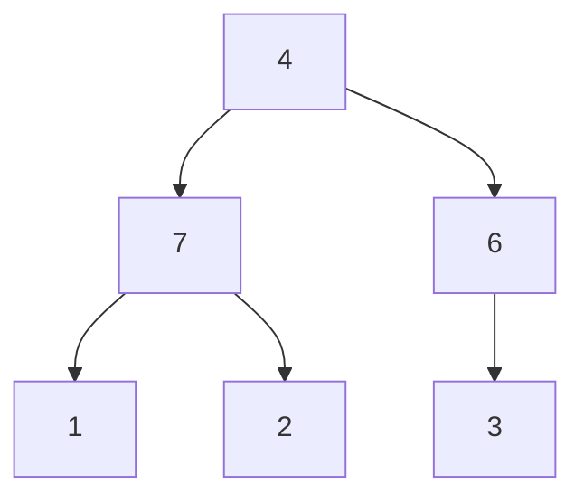
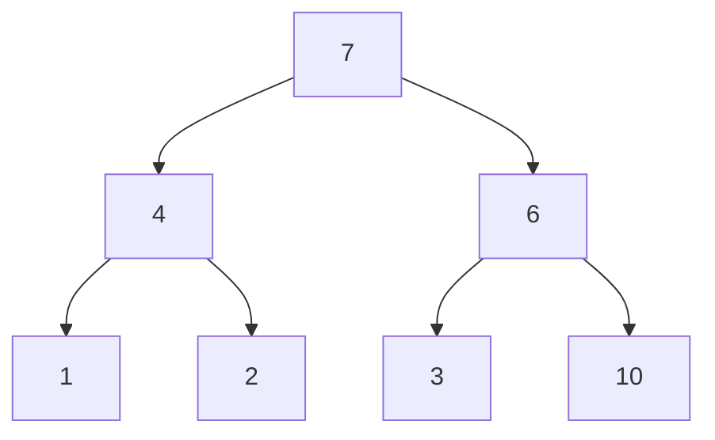
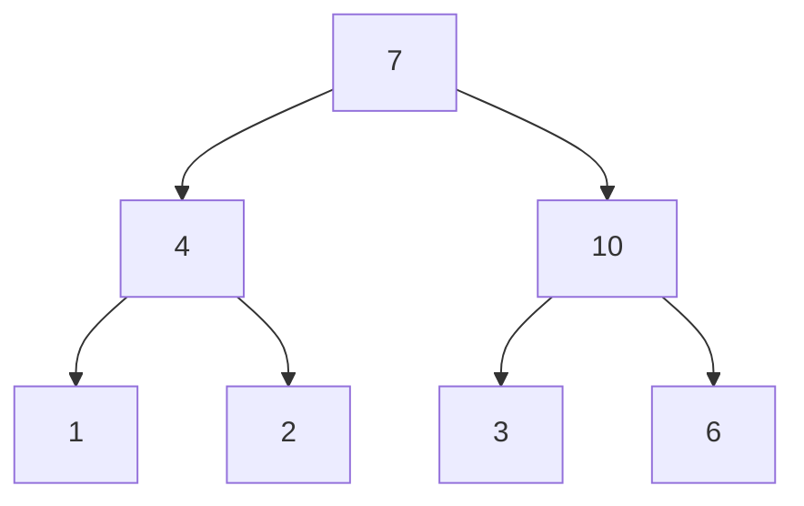
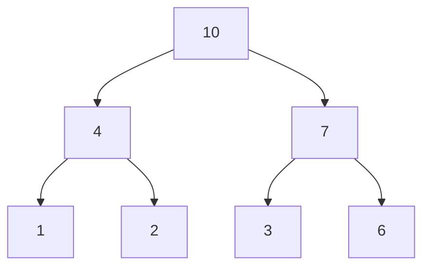

트리에서,
항상 부모 노드가 모든 자식 노드보다 크면 "Max Heap"
항상 부모 노드가 모든 자식 노드보다 작으면 "Min Heap"

# Pop







# push (10)







삽입 : $log(N)$
삭제 : $log(N)$
정렬 : $Nlog(N)$

# 사용 방법

```c++
#include <queue>
#include <iostream>
using namespace std;
struct comp {
	bool operator()(int a, int b){
		return a>b;
	}
}
int main(){
	priority_queue<int> pq; // default : max heap
	priority_queue<int, vector<int>, greater<int>> mpq; // min heap
	priority_queue<int, vector<int>, comp> mpq2; // min heap

	pq.push(10);
	pq.pop();
	cout << pq.top() << '\n';
}
```