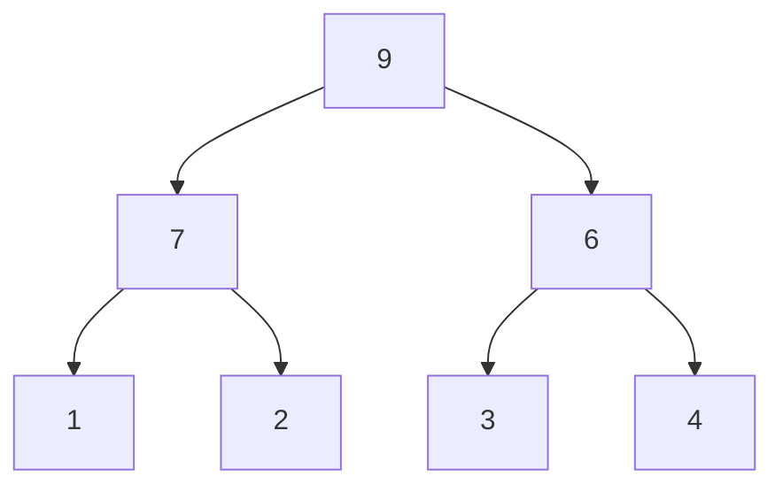
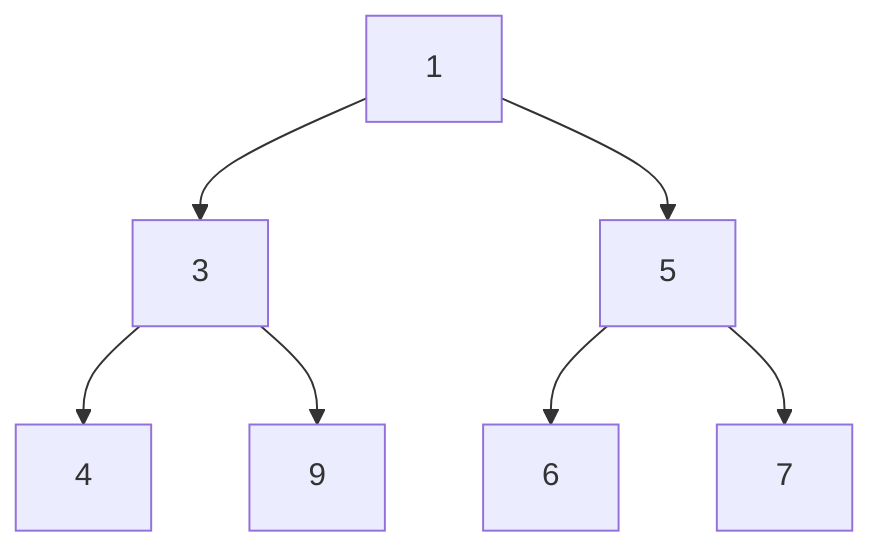

### Tree

- 사이클이 없는 그래프
	계층 구조를 표현하기 위해 사용됨
	보통은 양방향 그래프를 의미하지만, 사이클이 없는 단방향 그래프도 트리라고 부를 수 있음

~~응암순환선~~
### Heap

- 여러 개의 값들 중에서 최댓값이나 최솟값을 빠르게 찾아내도록 만들어진 자료구조
- 완전 이진 트리의 일종으로 우선순위 큐를 위하여 만들어진 자료구조

- 힙의 종류
	- 최대힙(max heap)
		- 부모 노드의 키 값이 자식 노드의 키 값보다 크거나 같은 완전 이진 트리

	- 최소힙(min heap)
		- 부모 노드의 키 값이 자식 노드의 키 값보다 작거나 같은 완전 이진 트리

- 시간복잡도
	- 삽입 : $log(N)$
	- 삭제 : $log(N)$
	- 정렬 : $Nlog(N)$

#### Trie

- 문자열 검색에 특화된 자료구조

- 문자를 저장하기 위해선 isTerminal값을 true로 저장

---
#### Balanced binary search tree

- 이진 탐색 트리에서 새로운 노드가 삽입 될 때, 부모의 노드보다 작은 값은 왼쪽 큰 값은 오른쪽으로 추가되는데 자료가 많이질수록 트리의 높이가 커지게 되어 최악의 경우 노트를 탐색하는데 log(n)이 소요됨
	- 이를 해결하기 위해 균형 이진 트리가 나오게 됨
###### AVL 트리

- 오른쪽 자식 트리의 높이 차이가 최대 1이 되도록 유지함으로써 균형을 맞춤
- 균형이 꺠지는 상황
	- RR
		- 오른쪽으로 편향된 경우
		- 왼쪽으로 회전해서 해결
	- LL
		- 왼쪽으로 편향된 경우
		- 오른쪽으로 회전해서 해결
	- LR
		- 왼쪽 오른쪽으로 편향된 경우
		- RR회전 후 LL회전으로 해결
	- RL
		- 오른쪽 왼쪽으로 편향된 경우
		- LL회전 후 RR회전으로 해결
- 장점
	- 모든 경우에서 시간 복잡도는 O(log n)
- 단점
	- 구현이 어렵고 재균형을 잡는데 시간이 듦

###### Red Black tree

- 이진 탐색 트리의 한 종류
- 특징
	- 모든 노드는 red 아님 black
	- 루트 노드는 black
	- nil 노트가 존재(모든 nil 노드는 블랙)
	- red의 자녀들을 반드시 black(연속 red는 허용하지 않음)
	- 임의의 노드에서 자손 nil 노드까지 가는 경로들의 black의 수는 같다

- 균형이 깨지는 경우
	- 삽입 
		1. 첫 노드 삽입 시 루트노드가 레드
			- 블렉으로 변경
		2. 노트 삽입 후 부모 형제 노드간이 레드
			- 삽입한 노드의 부모와 부모의 형제 노드를 블렉으로 변경
			- 부모의 부모 노드를 레드로 변경, 부모의 부모 노드가 루트인지 더블 레드인지에 따라 조정 진행
		3. 노드 삽입 후 부모 노드의 형제 노드가 블랙이거나 없을 때
			- 가운데 노드를 부모 노드로 선정하고 블랙으로 변경. 나머지 두 노드를 자식 노드로 두고 레드로 변경
	- 삭제
		- 삭제되는 색이 중요함
		1. 삭제 대상이 빨간색이면 어떠한 속성도 위반하지 않아 그대로 둠
		2. 삭제 대상이 블랙이고 그 자리에 오는 노드가 레드인 경우
			- 해당 자리로 오는 레드 노드를 블랙으로 변경
			- 경우에 따라 반복해서 바꿔줘야함